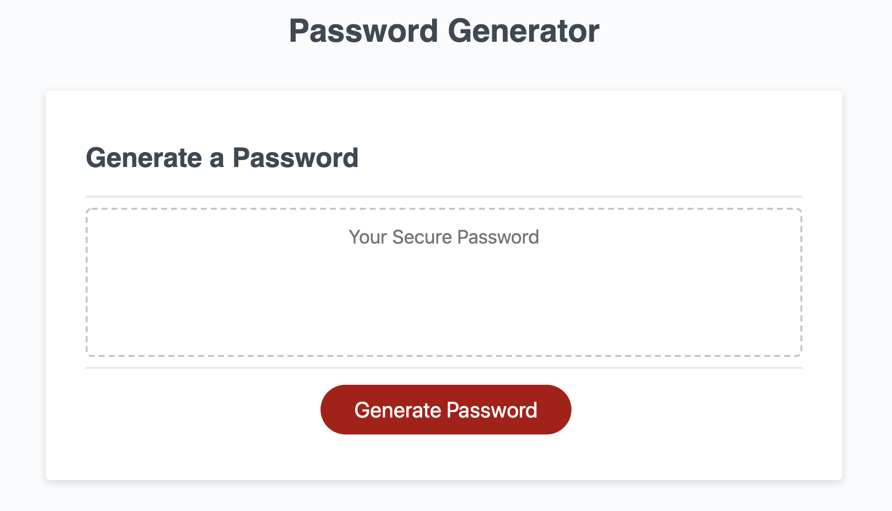
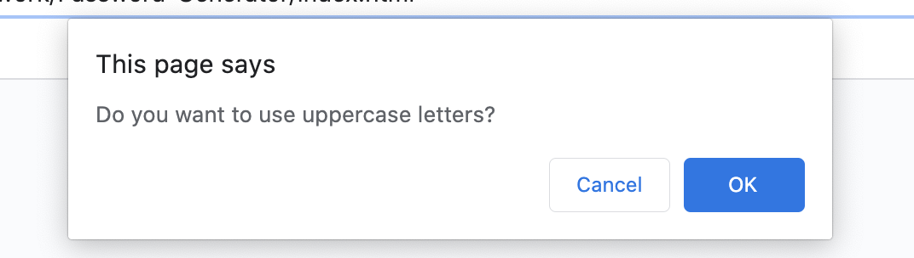
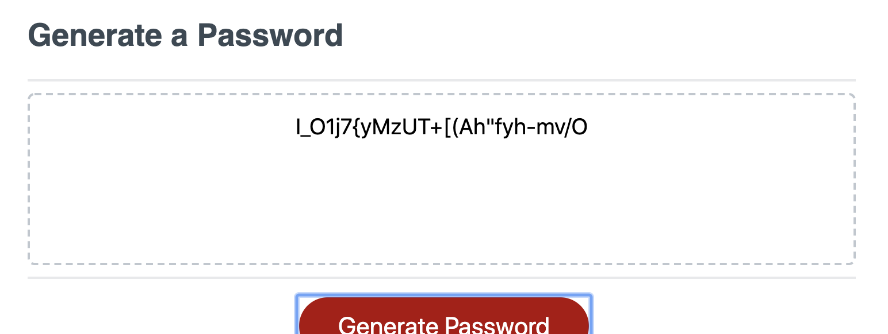

# Password-Generator

Generate a password with a simple click of a button!

___

## Description

Using a series of prompts, the user will be able to interact with the password generator to create a desired password.  This will combine together letters, numbers, and special characters along with a user selected character length to create a string of charters to generate a password for the user.
___

## How It Works

The password generator is designed to assist the user with comprising a password that is composed with the parameters of their choosing.  The user begins the process by selecting the "Generate Password" button in the middle of the screen.

This selection will trigger the "generatePassword" function which will then give the user a series of alerts that will allow the user to decide the parameters for his/her password. An example of one of these prompts can be see below:

The user has the choice of a password containing uppercase letters, lowercase letters, numbers, and special characters. These selections are then stored in an "allCharacters" array that be stored until a password length is set.

From there, the user will prompted to enter a password length. The password is required to have length between 8 to 128 characters. If the user types in a number that is outside of this range, they will be met with the following alert and prompted to restart the process from the beginning:

If the user selects a proper number for the length of the password, (between 8 to 128 characters), the "finalPassword" function will run and return a password that includes the parameters of the users choosing.

The user will then need to hit the "Generate Password" button to restart the process again.

___

## Technologies

- HTML
- CSS
- Javascript
- Visual Studio Code

___

### License

Copyright 2020 CHELSEY CRAIG

Permission is hereby granted, free of charge, to any person obtaining a copy of this software and associated documentation files (the "Software"), to deal in the Software without restriction, including without limitation the rights to use, copy, modify, merge, publish, distribute, sublicense, and/or sell copies of the Software, and to permit persons to whom the Software is furnished to do so, subject to the following conditions:

The above copyright notice and this permission notice shall be included in all copies or substantial portions of the Software.

THE SOFTWARE IS PROVIDED "AS IS", WITHOUT WARRANTY OF ANY KIND, EXPRESS OR IMPLIED, INCLUDING BUT NOT LIMITED TO THE WARRANTIES OF MERCHANTABILITY, FITNESS FOR A PARTICULAR PURPOSE AND NONINFRINGEMENT. IN NO EVENT SHALL THE AUTHORS OR COPYRIGHT HOLDERS BE LIABLE FOR ANY CLAIM, DAMAGES OR OTHER LIABILITY, WHETHER IN AN ACTION OF CONTRACT, TORT OR OTHERWISE, ARISING FROM, OUT OF OR IN CONNECTION WITH THE SOFTWARE OR THE USE OR OTHER DEALINGS IN THE SOFTWARE.